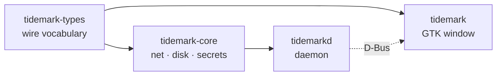

# Repository Guidelines

## Project Overview

Tidemark shows how much AI-provider quota is left, on the Linux desktop. A background daemon
(`tidemarkd`) polls providers, files readings into SQLite, and publishes them on the session
bus; a GTK4 + libadwaita window (`tidemark`) renders one card per account. Native only — no
Electron, no embedded webview.

Rust workspace, edition 2024, MSRV 1.92 (gtk4-rs 0.11 floor), MIT, `github.com/zbndev/tidemark`.
Runtime floor is GTK 4.22 / libadwaita 1.9 → Fedora 44+, Ubuntu 26.04+, rolling distros.

`CONTEXT.md` is the normative design record; `docs/adr/` holds binding decisions. Treat both as
settled — do not relitigate them in code.

## Architecture & Data Flow

Four crates in a strictly enforced layering:



- `tidemark-types` reaches **nothing** — no network, disk, or display. Only `serde` + `zvariant`.
- `tidemark-core` owns providers, HTTP, SQLite, keyring. **Never the display.**
- `tidemarkd` is the only process allowed to hold both.
- `tidemark` is display-only and speaks D-Bus. It may **not** depend on `tidemark-core`,
  `reqwest`/`hyper`, or `rusqlite`/`libsqlite3-sys`.

`scripts/check-layering.sh` enforces this in CI. It is an architecture contract, not a lint.

**Poll → pixel:** `tidemarkd::main::run` loads `Config`, opens `History`, creates `Keyring`, then
`registry::accounts` → `Engine::poll_due` lazily builds `Arc<dyn Provider>` and awaits
`Provider::fetch` concurrently → `Engine::apply` calls `History::ingest(&Snapshot)` and
`ProviderStatus::set_reading` → publisher task runs `Published::upsert` then
`Daemon::provider_changed`. On the UI side `bus::watch` drives `DaemonProxy` through
`glib::spawn_future_local`; signals become `Update::Changed`; `MainWindow::handle` calls
`show_all`/`show_one`; `Card::apply` converts back with `ProviderStatus::to_snapshot`;
`QuotaBar::set` draws value and pace mark on a `gtk::DrawingArea` with Cairo.

**D-Bus surface:** bus name `io.github.zbndev.Tidemark.Daemon`, object path
`/io/github/zbndev/Tidemark`, interface `io.github.zbndev.Tidemark.Daemon1`, methods
`GetStatus` / signal `ProviderChanged`. App ID is `io.github.zbndev.Tidemark`. The daemon is
D-Bus-activated via `data/dbus-1/services/` → systemd **user** unit `tidemarkd.service`. It is a
public contract — `busctl` and Waybar modules consume it:

```bash
busctl --user introspect io.github.zbndev.Tidemark.Daemon /io/github/zbndev/Tidemark
busctl --user call io.github.zbndev.Tidemark.Daemon /io/github/zbndev/Tidemark \
    io.github.zbndev.Tidemark.Daemon1 GetStatus
```

Published shapes are extensible `a{sv}` dictionaries: **absent values must stay absent** — never
substitute a default.

## Key Directories

| Path | Purpose |
| --- | --- |
| `crates/tidemark-types/src/` | `present`, `snapshot`, `time`, `window`, `wire`, `ids` (app/bus constants) |
| `crates/tidemark-core/src/providers/` | `Provider` trait, shared transport, `keyed/`, `claude`, `codex`, `antigravity/` |
| `crates/tidemark-core/src/storage/` | `mod.rs` (`History`), `schema.rs` (migrations), `segment.rs` (reset boundaries) |
| `crates/tidemark-core/src/` | also `config` (TOML), `paths` (XDG), `oauth` (loopback PKCE), `oauth_file`, `secrets` |
| `crates/tidemarkd/src/` | `engine`, `registry`, `service`, `keyring`, `scheduler`, `notify`, `startup`, `update` |
| `crates/tidemark/src/` | `window`, `bus`, `card`, `bar`, `chart`, `detail`, `grid`, `model`, `tray`, `provider_settings/` |
| `scripts/` | Layering, packaging, desktop-integration and release automation (all shellchecked) |
| `data/` | systemd unit, D-Bus service, desktop/autostart entries, AppStream metainfo, icons, packaging hooks |
| `docs/adr/`, `docs/superpowers/` | Binding decisions; dated design specs and implementation plans |

Root `src/` is empty, gitignored dead scratch — not a Cargo target. `pkg/`, `.worktrees/`,
`target/`, `*.pkg.tar.*` are build output: never edit or commit.

## Development Commands

```bash
cargo build --workspace
cargo run -p tidemark

# The full local gate (from .superpowers/sdd/global-constraints.md)
cargo fmt --check && cargo clippy --workspace --all-targets -- -D warnings \
  && cargo test --workspace && ./scripts/check-layering.sh
```

CI (`ubuntu-26.04`, `.github/workflows/ci.yml`) runs exactly:

```bash
cargo fmt --all --check
cargo clippy --workspace --all-targets -- -D warnings
dbus-run-session -- cargo test --workspace
scripts/check-layering.sh
scripts/check-desktop-integration.sh
scripts/test-restart-user-daemon.sh
shellcheck scripts/*.sh data/restart-user-daemon \
  data/packaging/deb/postinst data/packaging/rpm/post-install.sh
```

Build prerequisites: `libgtk-4-dev libadwaita-1-dev libsqlite3-dev pkg-config` (Fedora:
`gtk4-devel libadwaita-devel sqlite-devel pkgconf-pkg-config`). There are **no** `build.rs`
files, no Blueprint, no gresource — nothing to pre-compile.

Run-by-hand only (no workflow triggers them): `scripts/test-release.sh` and
`scripts/test-package-upgrade.sh [workdir]` (needs Docker, privileged systemd containers).

Release: `scripts/release.sh X.X.X` from clean, up-to-date `main`. It bumps the workspace
version, inter-crate constraints, `Cargo.lock`, the AppStream `<release>` entry, and `PKGBUILD`
`pkgver`/`pkgrel=1`; commits `chore: bump to vX.X.X`; tags and pushes. AppStream release prose is
human work. Tag push starts the release workflow, so the script runs no tests.

## Code Conventions & Common Patterns

- **Errors:** contextual `thiserror` enums per domain — `ProviderError`, `StorageError`,
  `ConfigError`, `SecretError`, `LoginError`, `NotifyError`. `anyhow` is not used anywhere; do
  not introduce it. The UI maps async failures to `Update::Waiting` or logs them.
- **Async:** daemon uses a manually built Tokio multi-thread runtime with channels, locks and
  `JoinSet`, plus zbus. The UI is GLib-main-context local — `glib::spawn_future_local`, zbus
  async-io cooperates with GLib so no bridging channel is needed. `async_channel` exists solely
  to bridge the ksni tray thread.
- **State:** UI state is `Rc<RefCell<_>>` / `Cell` / `Weak`; the single custom GObject subclass is
  `grid::CardGrid`. Wiring is manual composition, trait objects and factory closures — no DI
  framework.
- **UI construction is programmatic.** There are no `.blp`, `.ui` or gresource files; widgets are
  built with builders and styled through `style::STYLE`.
- **Lints are hard:** `unsafe_code = "forbid"`, `missing_debug_implementations`, clippy `all`,
  `todo`, `dbg_macro`. Clippy runs with `-D warnings`.
- **Provider invariants:** slugs are permanent storage keys (config, Secret Service, history,
  D-Bus) — never rename a shipped one. `fetch` = transport plus a **pure** `parse`. A recognised
  but malformed window fails the whole fetch; only genuinely unknown window kinds may be skipped.
  Window keys derive from window *length*, never from the source field name.
- **Credentials:** never log a `Credential`. Keyring-locked is a state, not a crash. Third-party
  CLI credential files are field-merged atomically into their canonical vendor path only
  (ADR-0001) — never created, reformatted, or written to discovered copies.
- **Networking:** identify every request as `Tidemark/<version>`; never impersonate a browser.
  One proxy configuration for every client and subprocess; never proxy loopback.
- **Presentation:** never invent history points, quota lengths, reset times, or hide windows.
  70% / 90% are the shared card and notification thresholds. Order is the `providers` array —
  no urgency sorting, no separate order list. Config is edited in place; malformed config errors.
- Commit messages predominantly follow Conventional Commits with scopes: `fix(card):`,
  `feat(network):`, `docs:`, `ci:`, `chore:`.

### Adding a provider

1. Single-request API-key provider → `crates/tidemark-core/src/providers/keyed/<slug>.rs` with
   `PROVIDER_ID`, a pure `parse(body, captured_at)`, and `pub static SPEC: Spec` (title, auth
   placement, key hint, `OptionSchema`). Register with `pub mod <slug>` and `&<slug>::SPEC` in
   `keyed/mod.rs::CATALOG` — **alphabetically**. `registry::catalog`/`registry::account`
   enumerate `CATALOG`, so no daemon or UI change is required.
2. Multi-request or unusual auth → expose a `HandSpec` plus your own `impl Provider`, declare the
   module in `keyed/mod.rs`, and add it to `tidemarkd/src/registry.rs::HAND_WRITTEN`.
3. OAuth → a core client plus `registry.rs` entries in `OAUTH`, `account`, `oauth_client`,
   `login_document`; use `Account::with_client`/`with_rebuild` and `Source::{Auto,OAuth,Cli}`.
   OAuth credentials are `Kind::Token`; API keys are `Kind::Key`. System browser via `xdg-open`
   with a loopback callback (ADR-0002); the callback port is declared by the provider and closed
   immediately after use (ADR-0003).
4. Add a `provider_label` arm in `tidemark-types/src/snapshot.rs` if generic slug capitalisation
   reads badly in notifications.
5. Update the README provider list and add the trademark/icon row in `docs/TRADEMARKS.md`.
   Symbolic marks must be filled outlines — `check-desktop-integration.sh` rejects SVG `stroke`.
6. Refuse to force multi-request / cookie / browser / other-CLI providers into `Keyed`.

## Important Files

- `crates/tidemarkd/src/main.rs`, `crates/tidemark/src/main.rs` — the two binaries' entry points.
- `crates/tidemark-core/src/providers/mod.rs` — the object-safe `Provider` trait (`id`, `account`,
  `fetch -> BoxFuture<'_, Result<Snapshot, ProviderError>>`).
- `crates/tidemark-core/src/providers/keyed/mod.rs` — `Spec`/`HandSpec` and the provider `CATALOG`.
- `crates/tidemarkd/src/{engine,registry,service}.rs` — polling, catalog construction, D-Bus.
- `crates/tidemark/src/{bus,window,card,bar}.rs` — the rendering path.
- `CONTEXT.md`, `docs/adr/0001..0003` — invariants and binding decisions.
- `scripts/check-layering.sh` — the machine-readable architecture rule.
- `Cargo.toml`, `rust-toolchain.toml`, `PKGBUILD`, `data/tidemarkd.service`.

## Runtime/Tooling Preferences

- Rust stable via `rust-toolchain.toml` (`clippy`, `rustfmt`; no pinned targets); MSRV 1.92.
- Cargo only. No `[workspace.dependencies]` — each crate declares its own deps.
- `Cargo.lock` is committed and machine-generated; change it through `cargo`, never by hand.
- TLS is rustls and secrets use `oo7` with `native_crypto` — deliberately no OpenSSL, no libsecret.
- The only Cargo feature in the workspace is `tidemarkd`'s default-on
  `update-check = ["dep:reqwest", "dep:semver"]`. Trademark-free builds are a packaging choice
  (drop `data/icons` and their asset lines), not a feature flag.
- Dependabot bumps Cargo weekly as one group.
- Packages are built on their oldest target OS: `.deb` on Ubuntu 26.04 (`cargo deb`), `.rpm` in a
  `fedora:44` container (`cargo generate-rpm`), Arch via `PKGBUILD`. Keep cargo-deb / RPM asset
  lists and `PKGBUILD package()` in sync. `PKGBUILD` sets `options=(!debug !lto)` on purpose and
  must not gain a `pkgver()`.

## Testing & QA

- Built-in `#[test]` and `#[tokio::test]` only. No `rstest`, `insta`, `mockito`, `wiremock`,
  `serial_test`, `proptest`, or snapshot files — do not add one without a reason.
- Tests are overwhelmingly colocated `#[cfg(test)] mod tests`: types 6, core 50, daemon 7, UI 16.
  Integration targets exist only in `crates/tidemark-core/tests/`: `proxy.rs`, `codex_provider.rs`,
  `claude_provider.rs`, `oauth_file.rs`, `provider_to_history.rs`, `corpus_replay.rs`. Reserve
  them for process-global behaviour (proxy selection) and cross-seam flows.

```bash
dbus-run-session -- cargo test --workspace          # exactly as CI runs it
cargo test -p tidemark-core
cargo test -p tidemark-core providers::antigravity::direct::tests -- --nocapture
cargo test -p tidemark chart::tests -- --nocapture  # passes without a display server
```

- **Naming:** descriptive sentence-style snake_case starting `a_` / `an_` / `the_`, e.g.
  `a_window_that_does_not_say_how_long_it_is_fails_rather_than_being_keyed_by_its_slot`.
- **HTTP:** hand-rolled loopback `TcpListener` on port 0 in a spawned thread, request captured
  over `mpsc`, literal HTTP response written back. Copy `providers/antigravity/direct.rs::tests::one_request_server`.
- **Time:** inject deterministic `Timestamp::from_unix(...)` through small `at`/`now`/`captured_at`
  helpers. There is no fake-clock crate and no Tokio time pausing.
- **SQLite:** `History::in_memory()`. **Filesystem:** RAII wrappers over `std::env::temp_dir()`
  with PID + atomic serial names and `Drop` cleanup (`oauth_file.rs::TestDir`,
  `codex.rs::tests::TestHome`). **Keyring:** pass an in-memory `FakeSecrets` implementing
  `crate::secrets::Secrets` — never touch the real Secret Service.
- **Fixtures:** `crates/tidemark-core/tests/fixtures/*.json` are loaded with `include_str!` /
  `include_bytes!` from the provider modules. Provider test bodies must come from recorded
  responses, not invention.
- Assert outcomes *and* stable window keys, lengths and reset instants; use
  `matches!(..., Err(ProviderError::Malformed { .. }))` for malformed-provider contracts.
- No coverage tooling or threshold is configured; "coverage" in the design docs means scenario
  coverage.
- Gotchas: without a session bus the Secret Service tests silently skip, so prefer the
  `dbus-run-session` form. `corpus_replay.rs` skips unless `TIDEMARK_CORPUS_DIR` or
  `~/.config/codexbar/history` exists — never commit corpus data.
