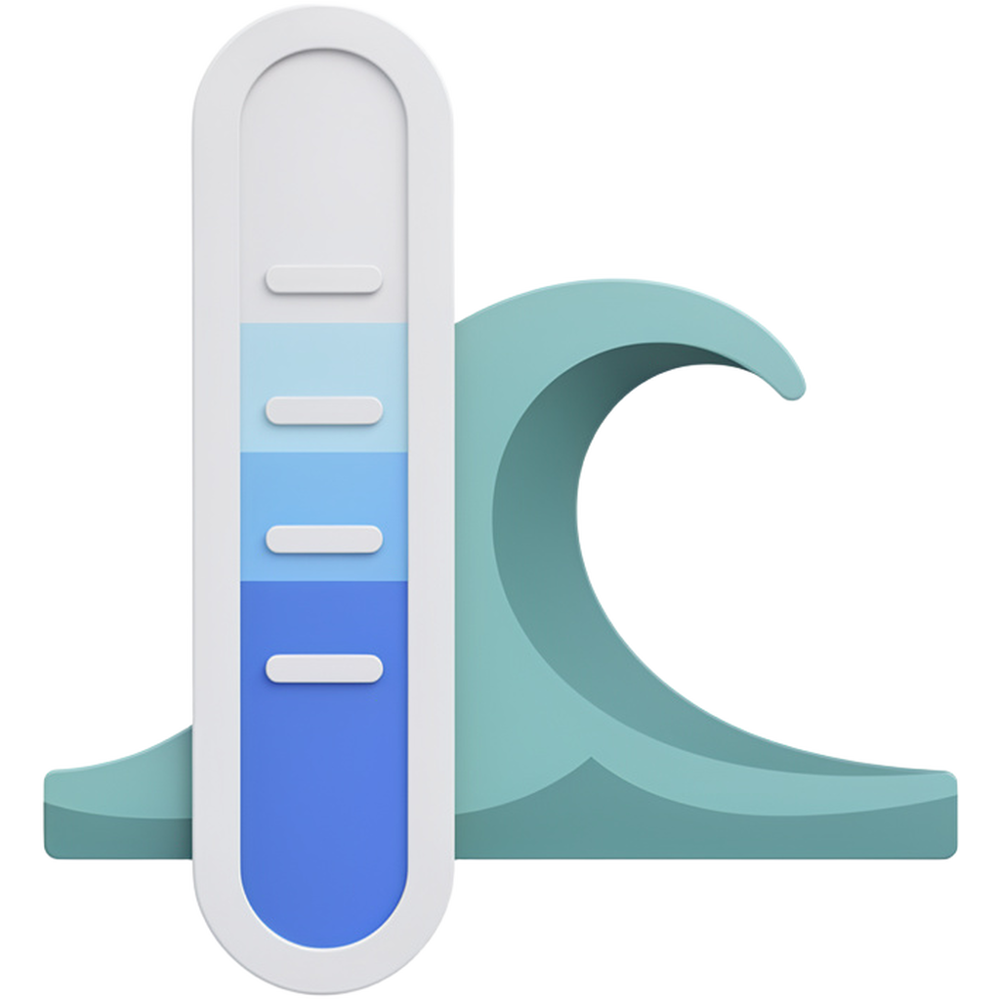

<div align="center">



# Tidemark

**See how much of your AI quota is left — on your Linux desktop.**


</div>

---

https://github.com/user-attachments/assets/a62a06a9-6a5f-408e-8347-bb5146c45a9d

---

Tidemark shows every rate-limit window your AI providers report: how much you have burned,
when it resets, and whether your current pace gets you there. One card per account, side by
side, so you can tell at a glance which provider to start a long run on.

A background service keeps polling while the window is closed, so the tray icon and the
notifications stay current. Native GTK4 + libadwaita — no Electron, no embedded browser.

- **Every window.** Five-hour, weekly, monthly — whatever the provider
  exposes, each with its own reset time.
- **A pace mark on every bar.** Fill to the left of the mark means the quota likely lasts until
  the reset; fill to the right means it does not.
- **Warnings at 70% and 90%,** plus a notification when a window resets. Off by default,
  switched on per window so you only hear about the ones you care about.
- **History and a burn-down chart.** Click a card to see how the current window was spent.
- **Lives in the tray.** Closing the window hides it; readings keep arriving.

## Installation

### Ubuntu/Fedora

Download the `.deb` or `.rpm` from the [latest release](https://github.com/zbndev/tidemark/releases/latest):

### Arch Linux

Install from AUR with yay/paru

```bash
yay -S tidemark-git
```

## Getting started

Open Tidemark. With nothing configured yet it says *Add a provider to start tracking your
quota*.

1. Open provider settings and press **+**.
2. Pick your provider from the searchable list.
3. Sign in, or paste an API key — the detail page says where to find it.

Keys are stored in your desktop keyring, never in a config file. Claude, Codex and
Antigravity can sign in through Tidemark, or reuse the login their own CLI already has.

Removing a provider deletes its credentials and its card but keeps the quota history.

## Reporting a wrong reading

If a card shows a number the provider's own dashboard disagrees with, the useful evidence
is the response Tidemark actually received. Put this in `~/.config/tidemark/config.toml`:

```toml
[debug]
raw_responses = true
```

then `systemctl --user restart tidemarkd`. Every provider response is written verbatim,
one JSON object per line, to `~/.local/share/tidemark/debug/responses.ndjson`:

```bash
jq 'select(.provider == "opencodego")' ~/.local/share/tidemark/debug/responses.ndjson
```

API keys are never written: request headers are left out entirely, URL query strings are
redacted, and the sign-in endpoints are not logged at all. The file still describes your
account's usage, so read it before attaching it to an issue. It rolls over at 16 MB and
keeps one previous file. There is no switch in the interface — turning it off is the same
edit, and a restart.

## Supported providers

**Sign in with your account**

Antigravity · Claude · Codex

**Paste an API key**

ai& · Amp · Chutes · ClawRouter · ClinePass · Codebuff · Crof · Deepgram · DeepInfra ·
DeepSeek · ElevenLabs · Factory · Fireworks · Groq · IBM Bob · Kilo · Kimi · LiteLLM ·
LLM Proxy · MiniMax · Moonshot · NanoGPT · Neuralwatt · OpenAI · OpenCode Go · OpenRouter ·
Poe · sub2api · Synthetic · Venice · Warp · xAI · Z.ai · ZenMux

**Local session**

Abacus · Augment · CommandCode · Cursor · Gemini · Grok · LongCat · Manus · MiMo · Mistral · Notion · Ollama · OpenCode · Perplexity · Qoder · Sakana · T3 Chat · ZoomMate

Cursor uses a cursor.com session already signed in on this machine — Tidemark does not store
an API key or session token. Its settings page asks you to choose one local source: the Cursor App, or one of
your browsers (and one of its profiles, if it keeps more than one). That choice is kept and
used alone; if the chosen source later signs out, Tidemark tells you instead of silently
switching to another browser or the App.

Gemini reads the Gemini CLI's own Google login in `~/.gemini/oauth_creds.json`. Run `gemini`
once and sign in; Tidemark refreshes the token in place, in the file's own shape, and stores
nothing of its own.

Grok reads the grok CLI's own login in `~/.grok/auth.json`. Run `grok login` once; Tidemark
reads the file in place, stores nothing of its own, and refreshes nothing — the CLI owns the
login, and an expired one asks for `grok login` again.

Abacus uses a signed-in abacus.ai browser session. Choose the browser profile that owns the
account; Tidemark keeps that choice and does not store the session token.

Augment uses a signed-in augmentcode.com browser session. Choose the browser profile that owns
the account; Tidemark keeps that choice and does not store the session token.

CommandCode uses a signed-in commandcode.ai browser session. Choose the browser profile that
owns the account; Tidemark keeps that choice and does not store the session token.

LongCat uses a signed-in longcat.chat browser session. Choose the browser profile that owns
the account; Tidemark keeps that choice and does not store the session token.

Mistral uses a signed-in mistral.ai browser session. Choose the browser profile that owns
the account; Tidemark keeps that choice and does not store the session token.

Notion uses a signed-in notion.com browser session. Choose the browser profile that owns the
account; when the account belongs to several workspaces, name the one to report on — the
first workspace is used otherwise.

Ollama uses a signed-in ollama.com browser session. Choose the browser profile that owns the
account; Tidemark keeps that choice and does not store the session token.

OpenCode uses a signed-in opencode.ai browser session. Choose the browser profile that owns
the account; Tidemark keeps that choice and does not store the session token.

Perplexity uses a signed-in perplexity.ai browser session. Choose the browser profile that owns
the account; Tidemark keeps that choice and does not store the session token.

Manus uses a signed-in manus.im browser session. Choose the browser profile that owns the
account; Tidemark keeps that choice and does not store the session token.

MiMo uses a signed-in platform.xiaomimimo.com browser session. Choose the browser profile that
owns the account; Tidemark keeps that choice and does not store the session token.

Qoder uses a signed-in qoder.com or qoder.com.cn browser session. Choose the browser profile
that owns the account; Tidemark keeps that choice and does not store the session token.

Sakana uses a signed-in console.sakana.ai browser session. Choose the browser profile that
owns the account; Tidemark keeps that choice and does not store the session token.

T3 Chat uses a signed-in t3.chat browser session. Choose the browser profile that owns the
account; Tidemark keeps that choice and does not store the session token.

ZoomMate uses a signed-in zoommate.zoom.us browser session. Choose the browser profile that
owns the account; Tidemark mints a fresh short-lived bearer for every poll and does not store it.

**No credential needed**

Wayfinder

Some providers need one extra setting alongside the key — a region, an account id, or the
base URL of your own deployment. The provider's page asks for it.

## Requirements

GTK 4.22 and libadwaita 1.9, which means **Fedora 44+** or **Ubuntu 26.04 LTS+** and their
derivatives. Older distributions cannot run it. Arch and other rolling releases are fine.

## Building from source

Needs Rust 1.92 or newer and the development packages for GTK4, libadwaita and SQLite:

```bash
git clone https://github.com/zbndev/tidemark.git
```

```bash
cargo build --workspace
```

```bash
cargo run -p tidemark
```

`tidemarkd` does the polling and `tidemark` is the window. The window never talks to a
provider itself — it only shows what the daemon publishes on D-Bus, which also makes the
daemon usable from `busctl` or a Waybar module. See [`CONTEXT.md`](CONTEXT.md) for the
architecture and the design record.

## License

MIT — see [`LICENSE`](LICENSE).

The provider marks under `data/icons` are their owners' trademarks and are not covered by
this licence; see [`docs/TRADEMARKS.md`](docs/TRADEMARKS.md), which also explains how to
build without them.

Provider protocol details are taken from [CodexBar](https://github.com/steipete/CodexBar)
(MIT).
